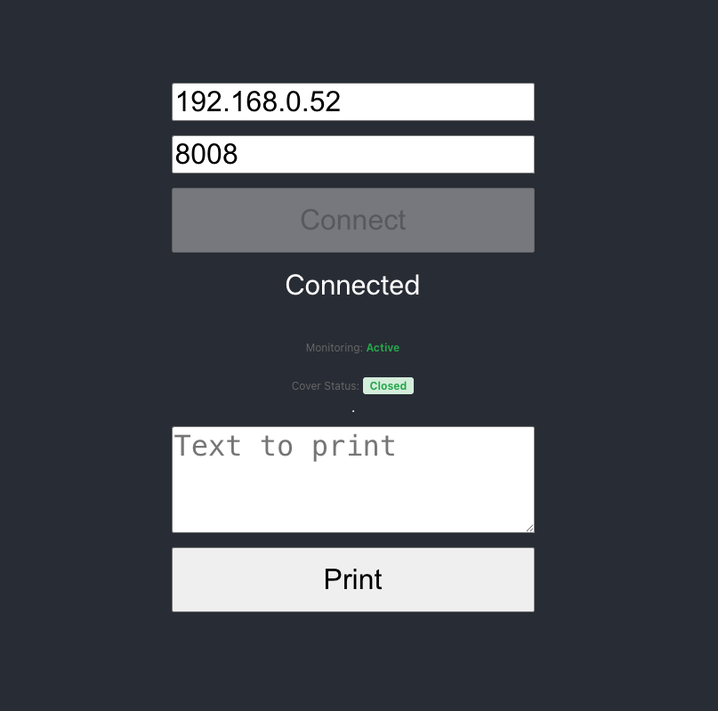

# Epson ePOS SDK with React JS

Printing from React JS to Epson thermal printers using the Epson ePOS SDK for JavaScript. Connect to network printers, print raw data, and monitor printer status in real-time.



## Quick Start

```bash
npm install
npm start
```

The `epos-2.27.0.js` file is already included in the `public` folder and will be automatically loaded when you start the app.

## How It Works

The Epson ePOS SDK is loaded from the `public` folder via a script tag in `public/index.html`:

```html
<script type="text/javascript" src="%PUBLIC_URL%/epos-2.27.0.js"></script>
```

React's `%PUBLIC_URL%` placeholder ensures the script loads correctly regardless of the app's route. The SDK exposes `window.epson` globally, which React components use to:

- Connect to network printers (no drivers required)
- Send print jobs
- Monitor printer status (cover open/closed, etc.)

After connecting to a printer, status monitoring starts automatically and displays real-time information in the UI.

## Usage

1. Enter your printer's IP address and port (default: 192.168.0.121:8008)
2. Click "Connect"
3. Once connected, enter text and click "Print"

## Documentation

For complete Epson ePOS SDK documentation, visit: [Epson ePOS SDK JavaScript Reference](https://reference.epson-biz.com/modules/ref_epos_sdk_js_en/index.php?content_id=1#BHIDAHEE)
